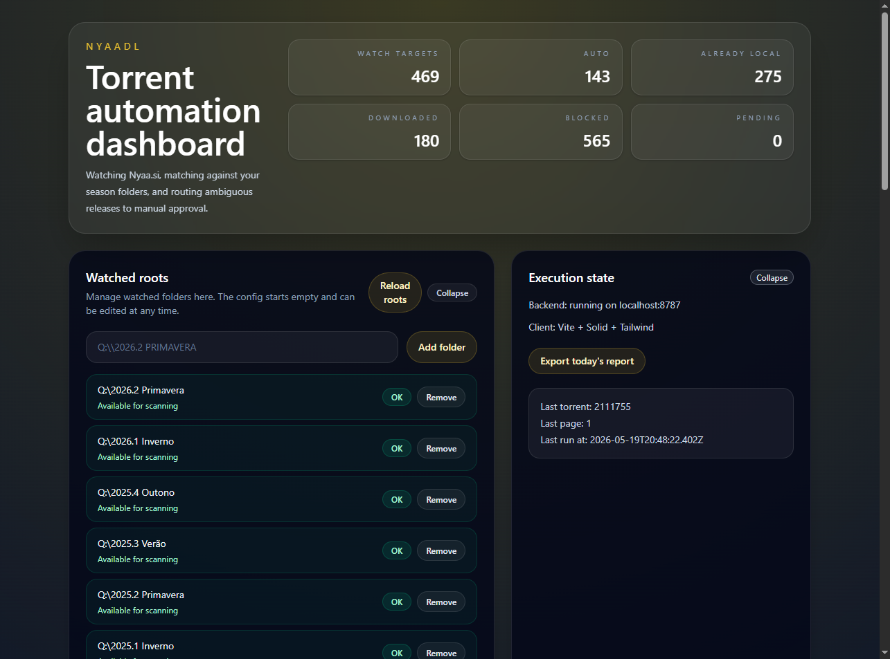
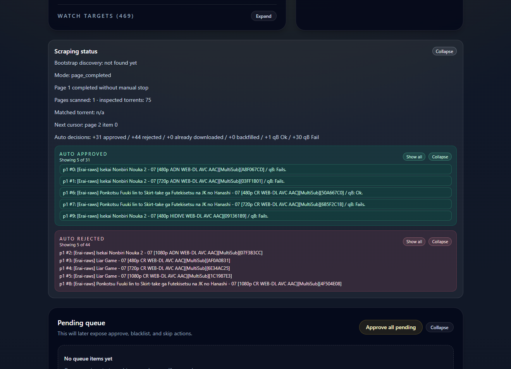

# nyaadl

[](docs/img/localhost_5173_full.png)
[](docs/img/localhost_5173_full.png)

NYAADL is a Node.js + TypeScript automation app for Nyaa scraping, torrent classification, manual approval, and qBittorrent Web API submission.

## What It Does

NYAADL scans your configured season folders, scrapes Nyaa pages from oldest to newest, matches releases using aliases and internal torrent filenames, checks whether the same episode and source already exist locally, downloads only new matched torrents, submits approved/auto-matched torrents to qBittorrent in paused mode, and sends ambiguous items to a manual approval queue.

## Install

```bash
npm install
```

## Run

```bash
npm run dev
```

This starts the backend on `http://127.0.0.1:8787` and the Vite client in development mode.

If you only want the backend, use:

```bash
npm run dev:server
```

If you only want the client, use:

```bash
npm run dev:client
```

## Build

```bash
npm run build
```

## Type Check

```bash
npm run typecheck
```

## Local Validation

```bash
npm run validate:local-library
```

This command exercises the local-library duplicate detection with real-style ADN and HIDIVE filenames, including exact-match and conflict scenarios.

## Legacy CLI

```bash
bun run index.ts
```

## Data Layout

- `data/folders-config.json` starts with an empty `folders` array and stores watched roots managed from the dashboard.
- `data/blacklist.json`, `data/pending.json`, `data/decisions.json`, `data/last_processed.json`, `data/bootstrap-discovery.json`, and `data/aliases.json` store runtime state.
- `data/qbittorrent-failures.json` stores qBittorrent submission failures that can be retried or suppressed.
- `data/qbittorrent-submitted.json` stores torrent IDs that were successfully submitted (or explicitly suppressed) so discovery backfill does not retry forever.
- Scraped snapshots and downloaded torrents are stored under `torrents/page-YYYY-MM-DD-N/`.

Example initial file:

```json
{
	"folders": []
}
```

You can add or remove watched roots from the dashboard or through the backend API:

- `GET /api/watchlist/folders`
- `POST /api/watchlist/folders` with `{ "folderPath": "Q:\\Your Season Folder" }`
- `DELETE /api/watchlist/folders` with `{ "folderPath": "Q:\\Your Season Folder" }`

Each page folder contains:
- `snapshot.html`
- `snapshot.json`
- downloaded `.torrent` files for that page

## Main Usage Flow

The expected day-to-day flow is now dashboard-first:

1. Start the app.
2. Add one or more watched root folders in the dashboard.
3. Click `Start scraping`.
4. The frontend calls `POST /api/bootstrap/discover-last-downloaded`.
5. The backend processes releases in incremental steps and updates the screen after each step.
6. If everything matches automatically, keep clicking `Continue scraping` until you reach the next page or the next manual review item.
7. If an item needs review, resolve that single item on screen with `Approve`, `Blacklist`, or `Skip`, then continue scraping.

The endpoint name still says `discover-last-downloaded`, but in practice this is now the main scraping flow started by the `Start scraping` button.

## What Happens During Scraping

Each scraping step does the following:

1. Refreshes watched roots and rebuilds watch targets from the first-level folders inside those roots.
2. Scrapes one Nyaa page, saves `snapshot.html` and `snapshot.json`, and starts processing items from the current cursor.
3. Tries to match a release against your local folder structure using the torrent title first.
4. If title matching is not enough, downloads the `.torrent` metadata and inspects internal filenames to improve matching.
5. Detects whether the episode already exists locally.
6. If the match is safe, downloads the `.torrent` file, stores it under the page archive folder, and tries to submit it to qBittorrent in paused mode.
7. If the match is ambiguous or there is a local conflict, stops after that one item and asks you to decide it.

The flow is intentionally incremental. One call returns at most one manual review item so the dashboard stays easy to drive.

Origin detection uses canonical provider tags such as `ADN`, `HIDIVE`, `CR`, `NF`, `AMZN`, `DSNP`, and similar variants found in release names and local filenames.

## Automatic Folder Matching

After you add watched roots, NYAADL scans the first-level folders inside them and builds watch targets. Each watch target is normalized into a series key plus resolution.

When new torrents appear on Nyaa, the system tries to connect each release to one of those watch targets automatically:

- First it compares the torrent title with normalized series aliases and resolution.
- If the title already points clearly to a watched folder, the system can route the torrent without reading torrent internals.
- If the title is not enough, the system reads the internal filenames from the `.torrent` metadata and uses them as extra evidence.
- If there is still no safe match, the item is sent to manual review.

## Manual Review Decisions

When the system cannot safely determine the destination, the screen shows one item needing review. You resolve it with one of three actions:

- `Approve`: downloads the `.torrent`, resolves the target folder from the best available metadata, records the decision, and tries to submit it to qBittorrent. If no matching watch target exists, a destination picker opens before the torrent is submitted. See [Approving Torrents Without a Matched Folder](#approving-torrents-without-a-matched-folder).
- `Blacklist`: rejects that series and resolution combination for future runs. The blacklist key is based on normalized series name plus resolution, so future items with the same series and resolution are auto-blocked.
- `Skip`: dismisses the current item without blacklisting it. This only skips that specific torrent. If a later torrent with the same series and resolution appears again, the system may ask you again.

Manual review happens one item at a time both in the live scraping card and in the `Pending queue` section.

## Approving Torrents Without a Matched Folder

When you click `Approve` for a pending item and no existing watch target matches the torrent, the system cannot determine where to save the files. Instead of failing silently, it opens a **destination picker** modal so you can specify the save location once. All subsequent episodes of the same series and resolution will then be matched automatically.

### When this happens

This occurs when a series has never been downloaded before and no folder for it exists inside any of your watched roots. The typical case is a brand-new show or a resolution variant you have not set up yet.

### What the destination picker shows

**Root folder**

A dropdown lists all currently configured watch roots. Each entry shows the full path and a `(missing)` label if the folder no longer exists on disk. At the bottom of the list is an `Enter custom path…` option that reveals a free-text input for a path that is not yet in your watch roots list.

**Series folder name**

Two options are shown, each pre-filled with a name derived from the torrent metadata:

- `From series title` — derived from the Nyaa listing title. Group prefix and resolution are preserved; only the episode number and trailing markers such as `END` are stripped.
- `From video filename` — derived from the actual filename of the video inside the `.torrent` file. The system downloads the torrent metadata to read this name if it was not already available. This option is useful when the Nyaa title differs from the filename used inside the archive.

Clicking either option copies its suggested name into the editable **Series folder** field below. You can then modify that field freely before confirming.

**Series folder**

A text input pre-filled with whichever source option is currently selected. Edit this to correct any part of the name before confirming.

**Full path preview**

A read-only line showing the exact path that will be passed to qBittorrent: `{root folder}\{series folder}`.

### Step-by-step example

Suppose a new torrent arrives for episode 9 of a series that has no folder yet:

```
[Erai-raws] Kimi to Boku no Saigo no Senjou Arui wa Sekai ga Hajimaru Seisen - 09 [720p].mkv
```

1. The system puts the item in the pending queue with reason `requires approval`.
2. You click `Approve`.
3. The system tries to match the torrent to a watch target and fails.
4. The destination picker opens automatically.
5. Under **Root folder**, select an existing root such as `Q:\2020.4 Outono`, or choose `Enter custom path…` and type a new root path.
6. Under **Series folder name**, the `From series title` option shows:
   ```
   [Erai-raws] Kimi to Boku no Saigo no Senjou Arui wa Sekai ga Hajimaru Seisen [720p]
   ```
   The `From video filename` option shows the name derived from the internal `.mkv` filename, which for Erai-raws releases is typically identical.
7. Click the option that looks correct. The name is copied into the **Series folder** field. Adjust if needed.
8. The **Full path** preview updates to show, for example:
   ```
   Q:\2020.4 Outono\[Erai-raws] Kimi to Boku no Saigo no Senjou Arui wa Sekai ga Hajimaru Seisen [720p]
   ```
9. Click `Confirm destination`.

### What happens after confirmation

The backend performs all of the following in a single step:

1. If the chosen root is not yet in your watch roots list, it is added automatically and saved to `data/folders-config.json`.
2. The series folder is created on disk at the full path shown in the preview.
3. Watch roots are rescanned so the new folder immediately becomes a watch target.
4. The `.torrent` file is submitted to qBittorrent with the confirmed path as the save location.
5. The decision is recorded as `approved` and the aliases file is updated with the series name.

Because the folder now exists as a watch target, any later episode of the same series and resolution — whether found during the current scraping session or a future one — will be matched automatically without prompting again.

### Folder name derivation

The suggested folder names follow the convention used by most release groups:

- The release group tag at the start is kept: `[Erai-raws]`, `[SubsPlease]`, etc.
- The resolution tag at the end is kept: `[720p]`, `(1080p)`, etc.
- Only the episode number and any trailing episode markers (`END`, `FINAL`, `BATCH`) are removed.

Examples:

| Torrent title | Suggested folder name |
|---|---|
| `[Erai-raws] Anime Name - 12v2 END [720p].mkv` | `[Erai-raws] Anime Name [720p]` |
| `[SubsPlease] Anime Name - 03 (1080p) [ABCD1234].mkv` | `[SubsPlease] Anime Name (1080p)` |
| `[Group] Anime Name - 01 [1080p].mkv` | `[Group] Anime Name [1080p]` |

You can always edit the **Series folder** field to match any naming convention you prefer before confirming.

## qBittorrent Submission Flow

For automatically matched torrents and manually approved torrents, NYAADL tries to add the saved `.torrent` file to qBittorrent through the Web API.

Current default behavior:

- Base URL: `http://localhost:7055`
- Username: `admin`
- Password source: runtime setting from the dashboard, or `qbittorrent password.txt` when no password has been entered in the UI
- API calls: `POST /api/v2/auth/login` when authentication is needed, then `POST /api/v2/torrents/add`
- Add options: `stopped=true`, explicit `savepath`, and original content layout

This means NYAADL will automatically try to connect to qBittorrent on localhost first. If qBittorrent is not reachable, requires different credentials, or rejects the session, the backend keeps a retryable failure record instead of losing the action.

Those failures appear in the dashboard recovery area, where you can:

- update base URL, username, and password
- retry the failed add
- suppress queue submission for that torrent with `Do not add torrent to queue`

## How Already Downloaded Detection Works

NYAADL tries to avoid downloading duplicate episodes into folders that already contain the same release.

There are two duplicate checks:

1. Fast title-based check when title matching already found the target folder.
	It compares the torrent title against local video filenames in the matched folder and looks for the same episode plus the same source/provider markers. It also compares optional markers such as episode tag and release hash when present.

2. Full metadata check when torrent internals are inspected.
	It extracts video filenames from the `.torrent`, derives episode/source fingerprints, and compares them to local files in the matched folder.
	If a local file has the same episode and source and also the exact same filename and file size, the item is marked `already_downloaded`.
	If the episode/source matches but the exact file differs, the result is treated as a conflict and sent to manual review.

This is why the UI may show either `Already downloaded` or a pending conflict for what looks like the same episode.

## Dashboard Sections

### Hero

The top hero section is the main control area.

Visible stats:

- `Watch targets`: how many normalized series folders are currently available for matching.
- `Auto`: how many torrents were auto-downloaded or auto-approved into the workflow.
- `Already local`: how many torrents were identified as already present locally.
- `Downloaded`: total successful downloads recorded in decision history.
- `Blocked`: how many items were rejected, including blacklist-based decisions.
- `Pending`: how many items are currently waiting in the manual queue.

Visible buttons and controls:

- `Start scraping`: starts the main incremental scraping flow by calling `POST /api/bootstrap/discover-last-downloaded`.
- `Continue scraping`: appears after a previous step returned a next cursor.
- `Reset scraping status`: clears the current bootstrap cursor and last scraping result in the frontend workflow.
- `force resubmit to qBittorrent`: when enabled, bootstrap steps also try to resubmit already processed approved torrents whose qBittorrent add should be retried or backfilled.

### Watched roots

This section is where the user sets up the library roots used for matching.

Visible items:

- input box for a root path such as `Q:\2026.2 PRIMAVERA`
- `Add folder`
- `Reload roots`: reloads configured roots and rebuilds watch targets discovered inside them.
- per-root status cards showing the folder path, whether the path exists and is a directory, an `OK` or `Missing` badge, and a `Remove` action
- warning banner when one or more roots are missing or invalid

The section also contains the `Watch targets` list, which shows the normalized per-series folders discovered inside the watched roots.

For watch targets, the UI shows:

- filter by folder, key, or root
- resolution filter
- total and filtered counts
- pagination
- each target folder name, normalized key, root name, and resolution badge

### Execution state

This section summarizes backend state and recovery tools.

Visible items:

- backend address indicator: `localhost:8787`
- client stack indicator: `Vite + Solid + Tailwind`
- `Export today's report`
- qBittorrent submission recovery panel, when there are failed submissions
- editable qBittorrent fields for base URL, username, and password
- `Save qBittorrent settings`
- per-failure cards showing the torrent title, torrent ID, source page, resolved target folder, failure message, optional suggestion, `Retry add to qBittorrent`, and `Do not add torrent to queue`
- checkpoint box showing the last torrent ID, last page, and last run timestamp
- current bootstrap error banner when the latest step failed
- `Retry this page` when the backend reports a stale cursor for the current page

### Scraping status

This section shows the result of the latest `Start scraping` or `Continue scraping` step.

Visible items:

- whether a checkpoint was found
- current mode such as `needs_review`, `page_completed`, or `no_items`
- human-readable reason for the current state
- `Pages scanned`
- `inspected torrents`
- `Matched torrent`
- `Next cursor`
- current manual review card when one item needs attention
- one-line auto decision summary with approved count, rejected count, already downloaded count, backfilled count, qB success count, and qB failure count

When available, the section also shows preview blocks for:

- `Backfilled`
- `Auto approved`
- `Auto rejected`
- `Already downloaded`

Each block supports collapse/expand, and when there are more than five items it also supports `Show all`.

If an item needs review, the section shows:

- torrent title
- reason for review
- `Approve`
- `Blacklist`
- `Skip`

### Pending queue

This section lists all items currently waiting for user action, not only the item returned by the latest scraping step.

Visible items:

- `Approve all pending`
- one card per pending item with the torrent title, detected series base name, resolution, source page, queue reason, current status badge, and `Approve`, `Blacklist`, `Skip` actions
- inline error panel if a queue action failed

Use this section when you want to clear older unresolved items without relying on the latest scraping result card.

### Torrent history

This section is the long-term decision log.

Visible items:

- text filter by torrent title
- resolution filter
- date range filter
- status chips with counts for `All`, `auto_downloaded`, `already_downloaded`, `blocked`, `pending`, `approved`, and `skipped`
- paginated history cards showing the torrent title, final status badge, series base name, resolution, source page, decision reason, published timestamp, seeders, leechers, downloads, and torrent ID
- pagination controls: `first`, `prev`, `next`, `last`

This is the best place to audit what happened after a scraping session.

### Bootstrap session log

This section is the session-scoped event log for the current dashboard runtime.

Visible items:

- `Export JSON`
- `Clear session`
- filter chips for `all`, `step`, `action`, and `error`
- search box for title, reason, page, and related text
- filtered count and total count
- paginated event list showing the event timestamp in UTC, event kind in brackets, event message, and optional page and item index
- pagination controls: `First`, `Previous`, `Next`, `Last`

Use this section to understand the exact sequence of scraping calls and user actions during the current session.

## Bootstrap API

The main scraping action is powered by:

- `POST /api/bootstrap/discover-last-downloaded`

Optional continuation body:

```json
{
	"page": 2,
	"itemIndex": 14,
	"cursorToken": "2:75:123456:123380"
}
```

The backend returns the current cursor, the next cursor, automatic decision summaries, and at most one `actionItem` for manual review.

## Aliases

- `data/aliases.json` maps normalized source names to canonical series keys.
- The app updates alias hints automatically from internal torrent filenames when a torrent is auto-downloaded or approved.
- You can edit the file manually if a release uses a persistent abbreviation.

## qBittorrent Recovery

- Base behavior: qBittorrent uploads are done via HTTP API on the configured base URL (default `http://localhost:7055`).
- Upload payload uses `multipart/form-data` with `fileselect[]`, `savepath`, and `stopped=true`.
- If upload fails (for example timeout, connection refused, auth/session issues), the backend stores the failed submission in `data/qbittorrent-failures.json`.
- The dashboard shows a recovery panel where you can:
	- adjust qBittorrent base URL/username/password
	- retry the same failed torrent submission
	- choose `Do not add torrent to queue` to suppress qBittorrent submission for that torrent
- Suppressing a failed submission marks the item as finalized and prevents repeated backfill attempts.

Recovery-related endpoints:

- `POST /api/qbittorrent/config`
- `POST /api/qbittorrent/failures/:id/retry`
- `POST /api/qbittorrent/failures/:id/suppress`

## Recovery

- If a JSON state file is malformed or partially corrupted, the app falls back to safe defaults and rewrites the file.
- To reset state manually, edit or clear the relevant file in `data/` and restart the server.
- If you want to clear the watched roots, empty `data/folders-config.json` or remove roots from the dashboard.

## Reports

The backend exposes a daily report endpoint at `/api/reports/:date`, where `:date` uses ISO format `YYYY-MM-DD`.

Example:

```bash
curl http://127.0.0.1:8787/api/reports/2026-05-18
```

You can also open the endpoint directly in the browser:

```text
http://127.0.0.1:8787/api/reports/2026-05-18
```

The response contains:

- the report date
- generation timestamp
- total decision count for the day
- counts by status
- the list of decisions included in the report

The dashboard also includes an "Export today's report" action that downloads the same JSON payload as `nyaadl-report-YYYY-MM-DD.json`.

## Notes

- The old flat `torrents/` files are not moved automatically.
- Torrent filenames are sanitized and saved inside the per-page archive folder.
- The dashboard exposes torrent history, pending items, root health, qBittorrent recovery actions, checkpoint details, and the latest autonomous bootstrap discovery result.
- In bootstrap summaries, the UI shows preview blocks for `Auto approved`, `Auto rejected`, `Already downloaded`, and `Backfilled` (5 items by default with `Show all`).
